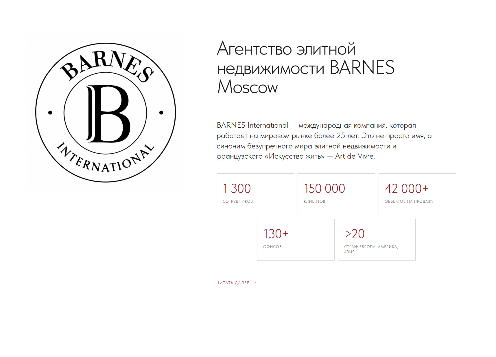
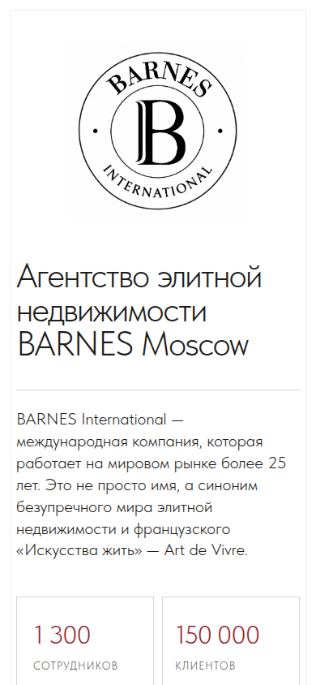
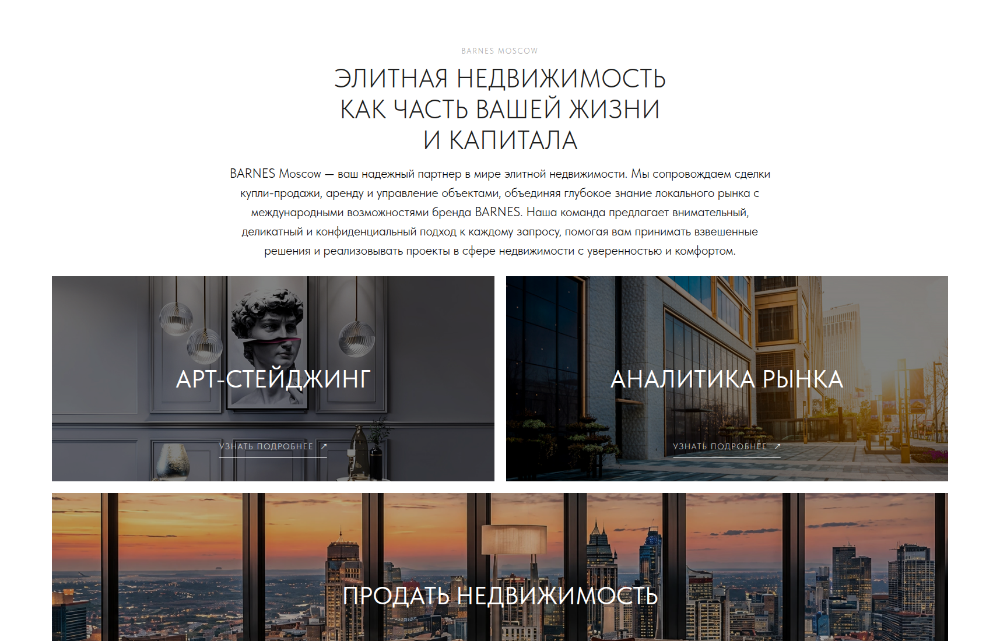
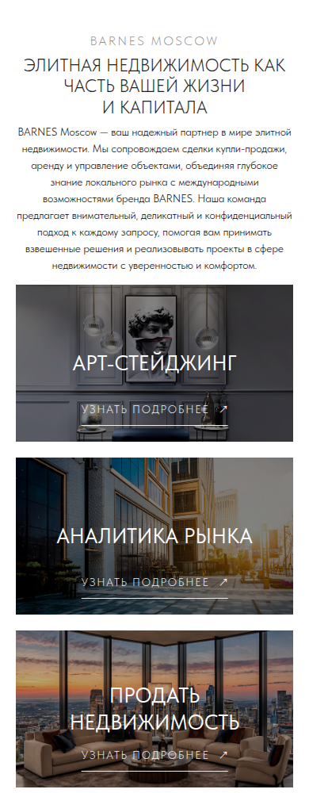

# Блок о BARNES

Самостоятельный HTML-блок «О BARNES» для BARNES Moscow.

Внутри:

- круглый логотип BARNES International;
- заголовок, вводный текст и пять ключевых показателей;
- раскрываемый полный текст по кнопке «Читать далее»;
- локальные шрифты Tilda Sans без внешних зависимостей.

## Просмотр

Откройте `index.html` в браузере или разместите содержимое репозитория на GitHub Pages.

Отдельные версии с видимой кнопкой «Читать далее»:

- [Desktop-версия](read-more/desktop/)
- [Mobile-версия](read-more/mobile/)

Отдельный блок с карточками услуг:

- [Элитная недвижимость — Desktop/Mobile](elite-real-estate/)

## Скриншоты

### Десктоп

### Мобильная версия

### Текущий блок с карточками

